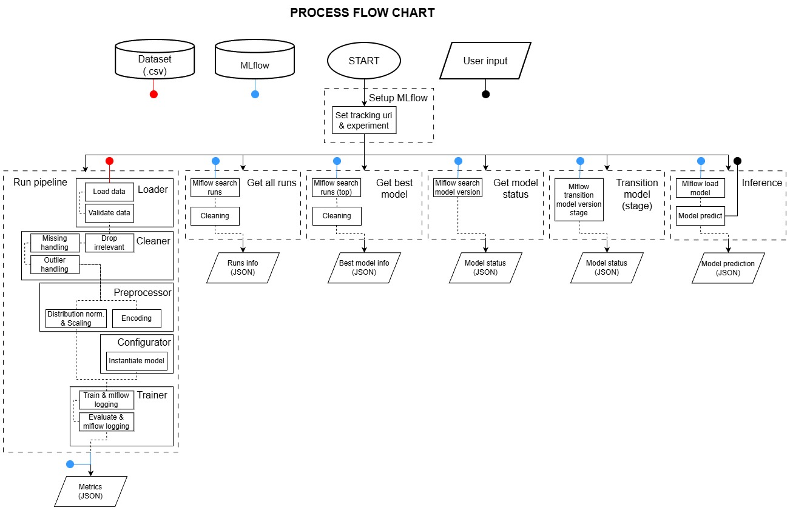

# Assignment: MLOPS

## Setup:
1. `git clone https://github.com/RifqiAnshariR/fastapi-mlflow-app.git`
2. `cd fastapi-mlflow-app`

## How to run:
1. `py -3.10 -m venv .venv` and activate it `.venv\Scripts\activate`
2. `pip install -r requirements.txt`
3. To run api: `python app.py`
4. To run all pipelines (test all pipelines): `python run.py`

## How to run (via Docker):
1. `docker build -t fastapi-mlflow-app .`
2. `docker run -d --name fastapi-mlflow-app_container -p 80:8000 fastapi-mlflow-app`

## Flowchart:

